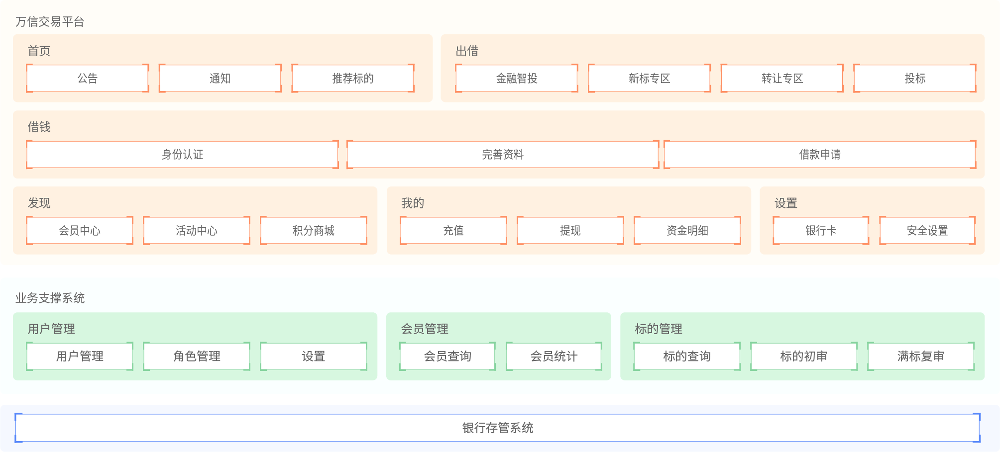
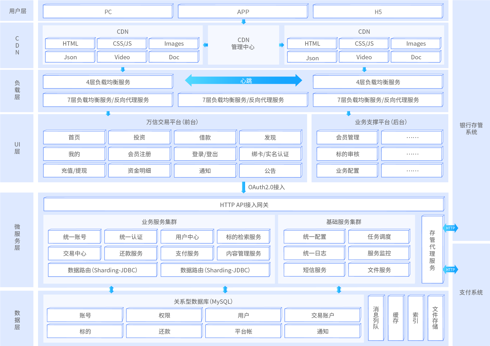
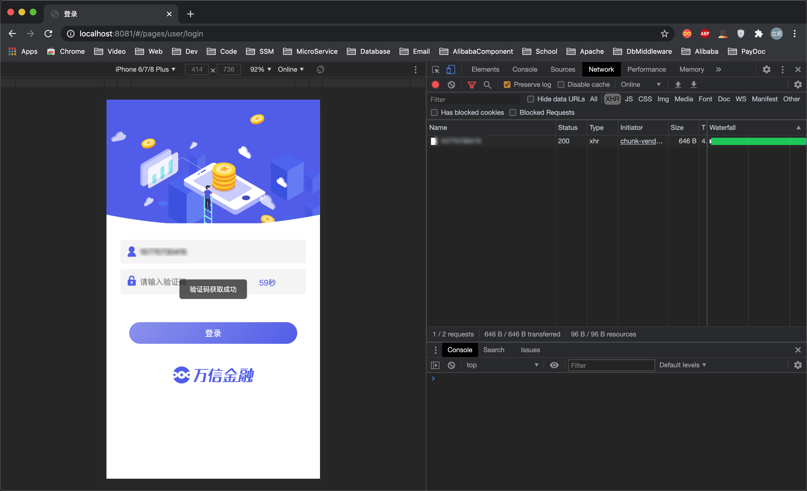
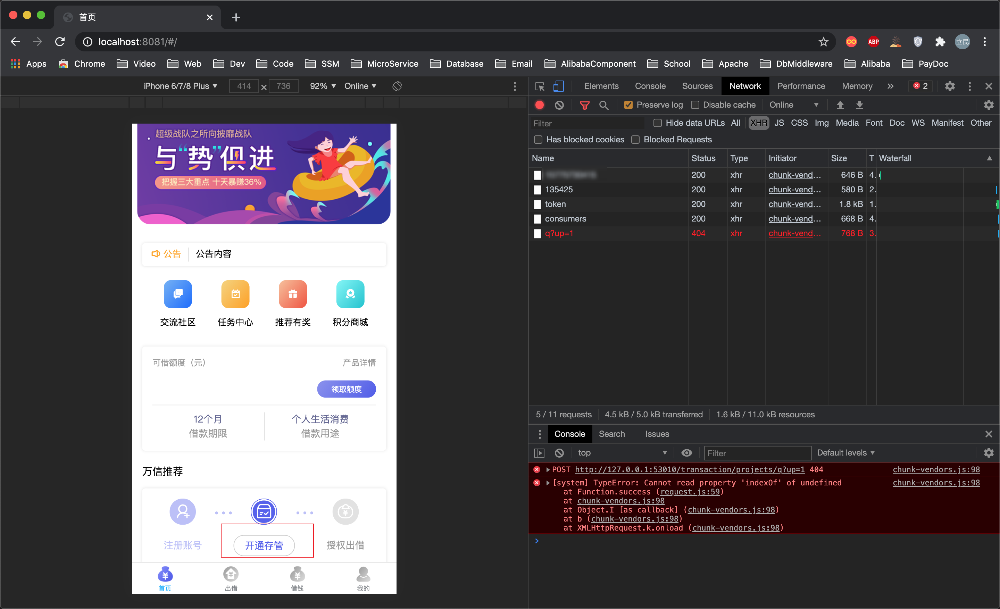
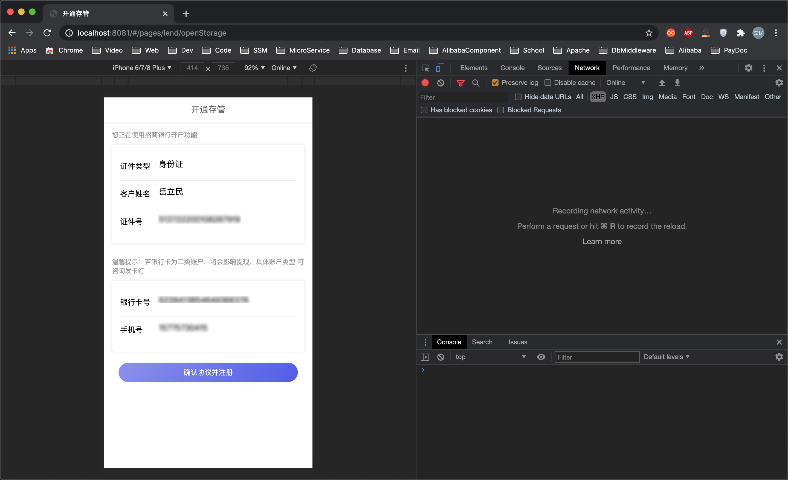
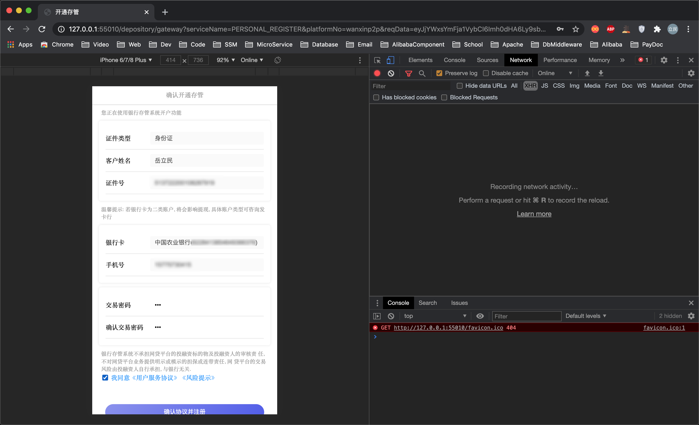
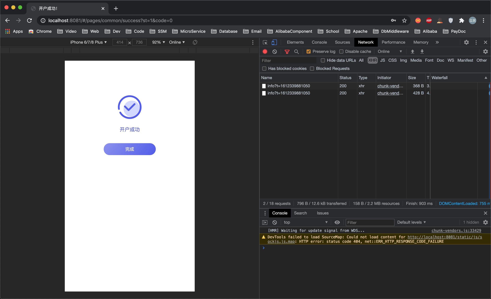

# wanxin(万信金融)-p2p

> 依赖项目

| Github地址                                         | 说明             |
| -------------------------------------------------- | ---------------- |
| https://github.com/mikuhuyo/wanxin-p2p-web.git     | 前端工程         |
| https://github.com/mikuhuyo/wanxin-p2p.git         | 后端工程         |
| https://github.com/mikuhuyo/wanxin-p2p-manager.git | 后台前端工程     |
| https://github.com/mikuhuyo/wanxin-depository.git  | 后台银行存管系统 |
| https://github.com/mikuhuyo/tencent-sms.git        | Tencent短信服务  |
| https://github.com/mikuhuyo/minio.git              | 存储服务         |

> 觉得写得蛮OK的就给打赏一杯咖啡吧.

## 项目介绍

万信金融是一个P2P(person-to-person)金融平台, 采用银行存管模式, 为用户提供方便, 快捷, 安心的P2P金融服务.
项目包括交易平台和业务支撑两个部分, 交易平台主要实现理财服务, 包括: 借钱, 出借等模块;

业务支撑包括: 标的管理, 对账管理, 风控管理等模块, 项目采用先进的互联网分布式系统架构进行研发, 保证了P2P双方交易的安全性, 快捷性及稳定性.

## 技术架构

### 功能架构图

### 技术架构图

### 技术解决方案

- 接口规范
  - SpringBoot+Swagger
- 持久层编码
  - MyBatis Plus
- 分布式系统配置中心
  - Apollo
- UAA认证方案
  - Spring Security Oauth2+JWT+ZUUL
- 分布式事务解决方案
  - RocketMQ
  - Hmily
  - requestNo同步机制
- 分库分表解决方案
  - Sharding-jdbc
- 分布式任务调度方案
  - Elastic-job
- 安全交易方案
  - HTTPS+SHA1withRSA
- 身份认证方案
  - 百度AI
- 短信验证系统方案
  - 短信验证服务+第三方短信平台(腾讯)

## 项目预览

### 用户登录/注册

### 开通存管

## 项目环境搭建与说明

### 端口与工程说明

| 工程                                             | 端口号 |
| ------------------------------------------------ | ------ |
| 注册与发现(wanxinp2p-discover-server)            | 53000  |
| 网关(wanxinp2p-gateway-server)                   | 53010  |
| uaa认证(wanxinp2p-uaa-service)                   | 53020  |
| 统一账号服务(wanxinp2p-account-service)          | 53030  |
| 用户中心服务(wanxinp2p-consumer-service)         | 53050  |
| 交易中心服务(wanxinp2p-transaction-service)      | 53060  |
| 存管代理服务(wanxinp2p-depository-agent-service) | 53070  |
| 还款服务(wanxinp2p-repayment-service)            | 53080  |
| 文件服务(wanxinp2p-file-service)                 | 56082  |
| P2P平台前端(wanxin-p2p-web)                      | 8081   |
| P2P平台管理端后台(wanxin-p2p-manager)            | 8079   |
| 短信验证码服务                                   | 56085  |
| 银行存管系统                                     | 55010  |

### 数据库说明

> Apollo配置中心数据库此处不做说明.

| 数据库名称             | 数据内容                  |
| ---------------------- | ------------------------- |
| `p2p_uaa`              | 统一认证数据              |
| `p2p_account`          | 统一账户数据              |
| `p2p_consumer`         | 用户中心数据              |
| `p2p_transaction_0`    | 交易中心数据库1           |
| `p2p_transaction_1`    | 交易中心数据库2           |
| `p2p_repayment`        | 还款中心数据              |
| `p2p_file`             | 文件存储服务              |
| `p2p_bank_depository`  | 银行存管系统              |
| `p2p_depository_agent` | 银行存管代理服务数据      |
| `p2p_reconciliation`   | 对账数据                  |
| `hmily`                | 分布式事务框架Hmily数据库 |

### 环境搭建

环境搭建比较容易出错就是Apollo配置中心的搭建, 我这里已经给出了`docker-compose.yml`文件直接执行就好了.

首先创建Apollo配置中心之前我们需要创建MySQL的环境, 我这里推荐`MySQL 5.7`, 创建完成之后执行Apollo配置中心的数据库脚本.

在`wanxin-p2p/resource/docker/`目录下执行`docker-compose up -d`, 等待执行完毕进行测试就OK了.
