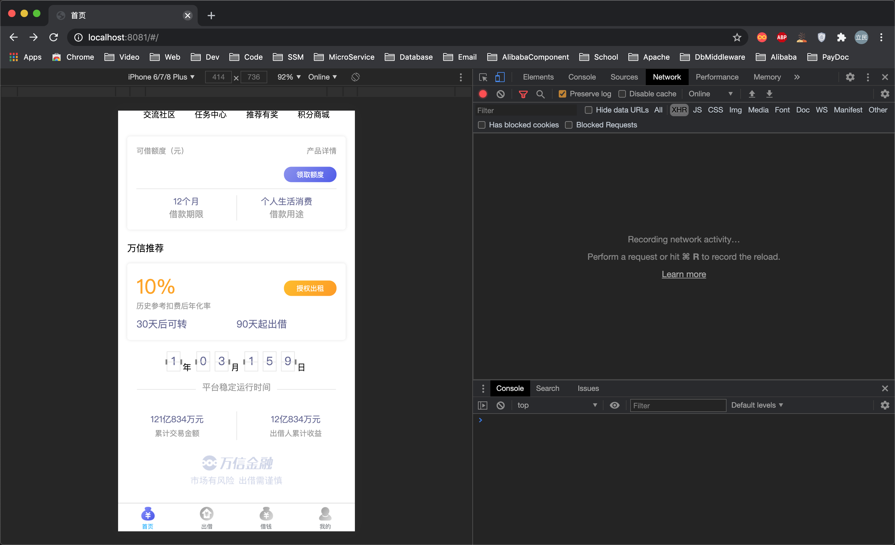
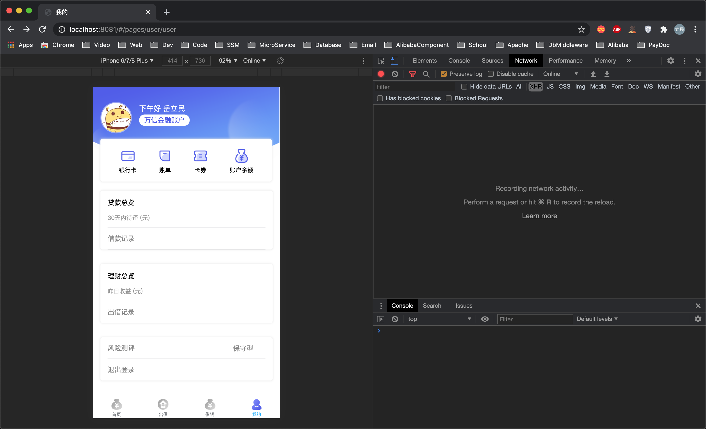

# 万信金融(wanxin-p2p)

[](https://github.com/mikuhuyo/wanxin-p2p/blob/master/LICENSE)
[](https://github.com/mikuhuyo/wanxin-p2p/issues)
[](https://github.com/mikuhuyo/wanxin-p2p/stargazers)
[](https://github.com/mikuhuyo/wanxin-p2p/network)


---

## 前言

关于万信金融这是一个我的个人学习项目, 项目采取目前比较流行的技术进行实现. 目前金融类的项目还是比较少的, 因此我比较中意此类项目.

关于项目文档, 由于`README.md`写太多不太合适, 因此我将项目介绍, 演示, 环境搭建, 部署等文档移动到`wiki`页面: https://github.com/mikuhuyo/wanxin-p2p/wiki

Ps: 万万没想到写文档和注释是这么痛苦.

## 项目介绍

### 项目背景

目前, 国家对P2P行业的监控与规范性控制越来越严格, 出台了很多政策来对其专项整治, P2P平台之 前所采用的"资金池模式"与"第三方支付托管"(见下文定义)已经不合规了, 国家主张采用"银行存管模式"来规避P2P平台挪用借投人资金的风险, 通过银行开发的"银行存管系统"管理投资者的资金, 每位P2P平台用户在银行的存管系统内都会有一个独立账号, P2P平台来管理交易, 做到资金和交易分开, 让P2P平台不能接触到资金, 就可以一定程度避免资金被挪用的风险.

> 什么是资金池模式?

此模式下, 投资人利用第三方支付/银行的通道先把资金打到平台的银行账户, P2P的平台就池子一样, 汇聚了投资人和借款人的资金, 这个汇集资金的池子叫做资金池, 是P2P平台方最容易跑路的模式.

> 什么是第三方支付托管模式?

此模式下, 投资人/借款人除了要在P2P平台注册外, 还要在第三方支付平台注册, 也就是平台和第三方各有一套账户体系. 经过第三方支付的资金托管后, 由于资金沉淀发生在第三方支付在银行的备付金账户上, P2P平台运营方只能看到投资人/借款人账户余额的变化及债权匹配关系, 不能像资金池那样擅自挪用投资人的钱, 但是这里存在安全风险的是第三方支付机构.

> 什么是银行存管模式?

此种模式下, 涉及到2套账户体系, P2P平台和银行各一套账户体系. 投资人在P2P平台注册后, 会同时跳转到银行再开一个电子账户, 2个账户间有一一对应的关系. 当投资人投资时, 资金进入的是平台在银行为投资人开设的二级账户中, 每一笔交易, 是由银行在投资人与借款人间的交易划转, P2P平台仅 能看到信息的流动.

### 项目概述

万信金融是一个P2P(person-to-person)金融平台, 采用银行存管模式, 为用户提供方便, 快捷, 安心的P2P金融服务. 项目包括交易平台和业务支撑两个部分, 交易平台主要实现理财服务, 包括: 借钱, 出借等模块;

业务支撑包括: 标的管理, 对账管理, 风控管理等模块, 项目采用先进的互联网分布式系统架构进行研发, 保证了P2P双方交易的安全性,快捷性及稳定性.

### 项目结构

```shell script
# docker
# resource
# sql
# wanxinp2p-account-service
# wanxinp2p-api
# wanxinp2p-common
# wanxinp2p-consumer-service
# wanxinp2p-content-search-service
# wanxinp2p-depository-agent-service
# wanxinp2p-discover-server
# wanxinp2p-gateway-server
# wanxinp2p-repayment-service
# wanxinp2p-transaction-service
# wanxinp2p-uaa-service
```

## 项目演示(部分)

### 后台管理

### 前台门户

用户注册/登录


开通存管




个人页面



## 技术选型

### 前端技术

| 技术       | 说明             |
| ---------- | ---------------- |
| Vue        | 前端框架         |
| Vue-router | 路由框架         |
| Vuex       | 全局状态管理框架 |
| Element    | 前端UI框架       |
| Axios      | 前端HTTP框架     |
| Uniapp     |                  |

### 后台技术

| 技术                 | 说明                |
| -------------------- | ------------------- |
| SpringBoot           | 容器+MVC框架        |
| SpringCloud | 微服务 |
| SpringSecurity Oauth2 | 认证和授权框架      |
| Apollo | 分布式配置中心 |
| MyBatisPlus              | ORM框架             |
| Swagger-UI           | 文档生产工具        |
| Redis                | 分布式缓存          |
| MongoDB              | NoSql数据库         |
| Docker               | 应用容器引擎        |
| MinIO                | 对象存储            |
| Elasticsearch        | 搜索引擎            |
| LogStash             | 日志收集工具        |
| Jenkins              | 自动化部署工具      |
| Elastic-Job | 分布式任务调度 |
| RocketMQ | 消息中间件 |
| Hmily | 分布式事务框架 |

## 架构图

### 业务架构图


### 系统架构图


## 开发相关

> 开发机器: MacBookPro 2015 (16GB + 256 GB)

### 开发工具

| 工具          | 说明                |
| ------------- | ------------------- |
| IDEA          | 开发IDE             |
| RedisDesktop  | redis客户端连接工具 |
| Robomongo     | mongo客户端连接工具 |
| SwitchHosts   | 本地host管理        |
| Navicat       | 数据库连接工具      |
| PowerDesigner | 数据库设计工具      |
| Axure         | 原型设计工具        |
| MindMaster    | 思维导图设计工具    |
| ProcessOn     | 流程图绘制工具      |
| Snipaste      | 屏幕截图工具        |
| Postman       | API接口调试工具      |
| Typora        | Markdown编辑器      |

### 开发环境

| 工具          | 版本号 |
| ------------- | ------ |
| JDK           | 1.8    |
| MySQL      | 5.7    |
| Apollo | Last |
| Redis         | 4    |
| MongoDB       | 4  |
| RocketMQ      | 4.4.0 |
| Nginx         | 1.10   |
| Elasticsearch | 6.4.2 |
| Logstash      | 6.4.2  |
| Kibana        | 6.4.2  |

## 特别鸣谢

### 关注者

[](https://github.com/mikuhuyo/wanxin-p2p/stargazers)

### 收藏者

[](https://github.com/mikuhuyo/wanxin-p2p/network/members)

## 给个赞助?


---


